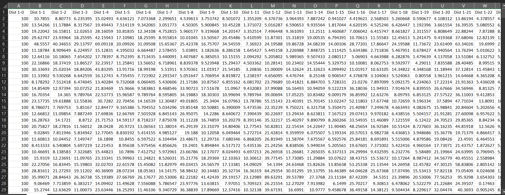
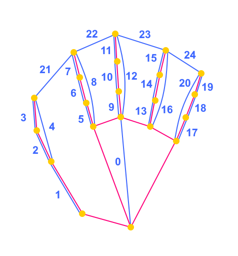

# Hand Sign Language Entepreter (HaSLI)

Lecturer : Prof. Dr. Goh Ong Sing

Project Manager: Ahmad Syazani Aniq bin Ahmad Khaizi
Project Members: 
  1) Hasif bin Mohamad Noh
  2) Muhammad Naqib Hakimi bin Hakmal
  3) Aiman Faris b. Mazri

Download the [APK File](https://drive.google.com/file/d/1VqzHEgbA8BqpSgVJruktaNIwynxj16w1/view?usp=sharing)

## Introduction

  HaSLI is a mobile app that can translate hand sign language into alphabet by using real-time camera. HaSLI can help people to interact with mute or deaf people or they can use this app to learn the sign language

  This app also provided all the sign language alphabets. User can practice using this app.
  
## Objectives

1) To help people understand the sign language
2) To help people to communicate with mute or deaf people
3) To help people learn and practice this language

## Design & Model

There are 2 layers of AI implemented in this project:
  1. [MediaPipe Hands](https://google.github.io/mediapipe/solutions/hands.html) (Library to tracks hand)
  2. Neural Network (To trace the hand signs)\n
    1. Layer 1 / Input Layer (150 Nodes, Sigmoid Activation Function)
    2. Layer 2 / Hidden Layer (150 Nodes, Sigmoid Activation Function)
    3. Layer 3 / Output Layer (26 Nodes)

## Data

Data were gathered manually. The data gathering was improvised and updated up until Version 4. HandRecBaseV4.py was used to gather the data. The gathered data was trained using hand_sign_nn.ipynb and then tested using HandRecBaseV4Test.py.

There are total of 150 (25x6) features inside the data. These features are divided into 6 sections. This is to have a capability to capture hand sign which has motion. The 25 [0-24] feature in each section are the distance of each nodes from the hand tracking.

## Comparing with CNN Model
As far as we understand,
### Pros over CNN
  - Simple, meaning it can run faster
  - It capable of capturing hand sign with motion like alphabet J and Z

### Cons over CNN
  - Less Accurate
  - It will continuously reads the hand sign even though the user does not have the intention to make a hand sign

## Deployment

Android Studio was used to develop and deploy into apps.
Apps can be downloaded from [here](https://drive.google.com/file/d/1VqzHEgbA8BqpSgVJruktaNIwynxj16w1/view?usp=sharing)

## Screenshots

\

1. Spaces for Character to build into word
2. Letter that was recognised
3. Button to add space into (1)
4. Button to take the character recognised from (2) into (1)
5. Button to clear up (1)
6. Button to switch the camera
7. Frame rate
8. Button to go to Hand Sign List
